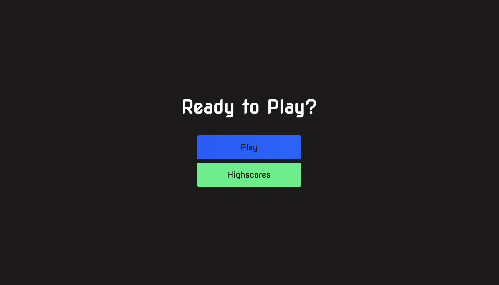
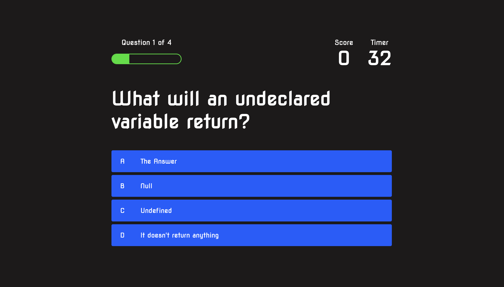
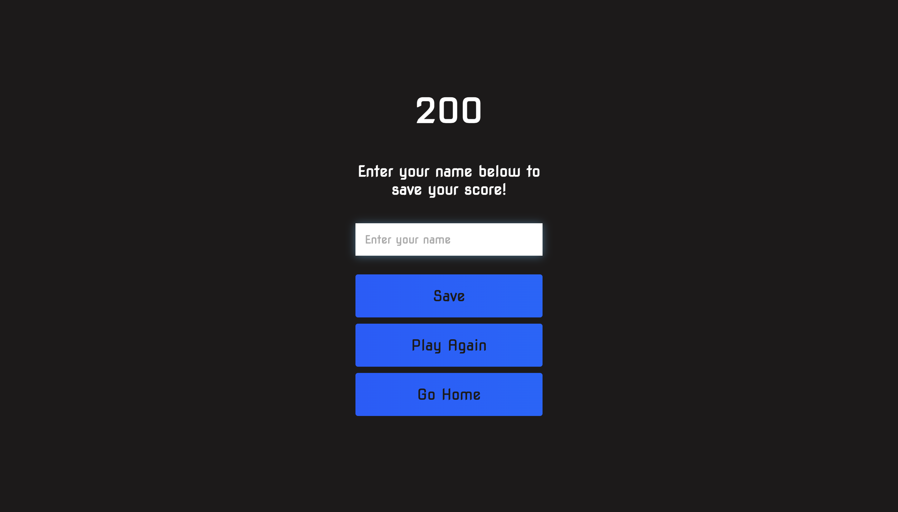

# Description
Allows the users to start a quiz, which is timed.  Keeps score when the user answers correctly and subtracts time if incorrectly.  Once completed, the user will be allowed to enter their name and save to the high score page.

## Screenshot

## Links

GitHub: https://github.com/RichardBaier/code-quiz

Deployed: https://richardbaier.github.io/code-quiz/